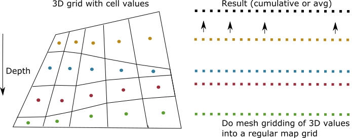

How it works
============

The scripts reads the Eclipse files or ROFF files and computes HCPV thickness
or weighted average of a property, per cell, layer by layer.

Then the value and position of each 3D cell (per layer) is
then gridded by a scipy/matplotlib method to form a regular map.

For HC thickness, the maps per layers are then summed, to form a
sum hc thickness map per zone or by all zones that are spesified.

For average maps, a thickness weighted average is computed.

Further details
---------------

Contact JRIV@equinor.com for further details.
