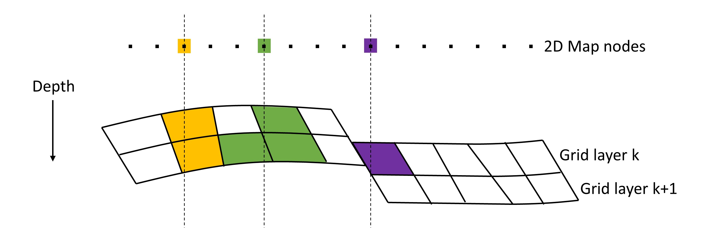

How it works
============

The scripts reads the Eclipse files or ROFF files and computes HCPV thickness
or weighted average of a property, per cell, layer by layer.

.. image:: images/gridding_approach.png

Then the value and position of each 3D cell (per layer) is
then gridded by a scipy/matplotlib method to form a regular map.

For HC thickness, the maps per layers are then summed, to form a
sum hc thickness map per zone or by all zones that are spesified.

For average maps, a thickness weighted average is computed.

This is not applicable to `grid3d_aggregate_map` and `grid3d_migration_time`,
which uses a different approach for aggregating layers.

`grid3d_aggregate_map` and `grid3d_migration_time`
--------------------------------------------------

`grid3d_aggregate_map` and `grid3d_migration_time` uses a different approach
when aggregating values. In general, the main difference from
`grid3d_hc_thickness` and `grid3d_average_map` is that the result will be less
smooth. Secondly, gaps in the grid (typically caused by faults), will not be
filled.

Each map node is first connected to all cells whose (approximate) footprint
overlaps the map node. An artificial set of connections are illustrated by
colors in the figure above.

Once the connections are established, the value of each map node is calculated
from all the connected grid cells via one of the specified aggregation
methods:

- Maximum
- Minimum
- Mean
- Sum

Layer information and lateral distance from map node to grid cell center is
currently not used. However, filters can be used to apply this per zone etc.

One benefit of this approach is that the map-node-to-grid-cell connection
information can be re-used across time steps and properties, as long as the
grid geometry does not change. This is beneficial for performance.

Further details
---------------

Contact JRIV@equinor.com for further details.
