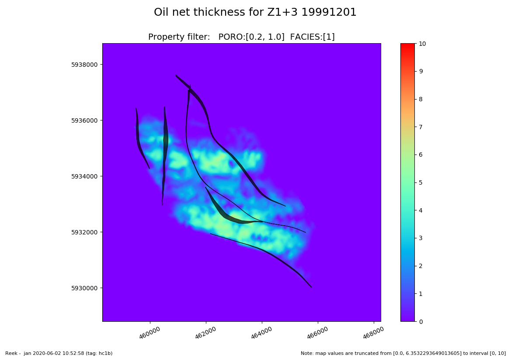
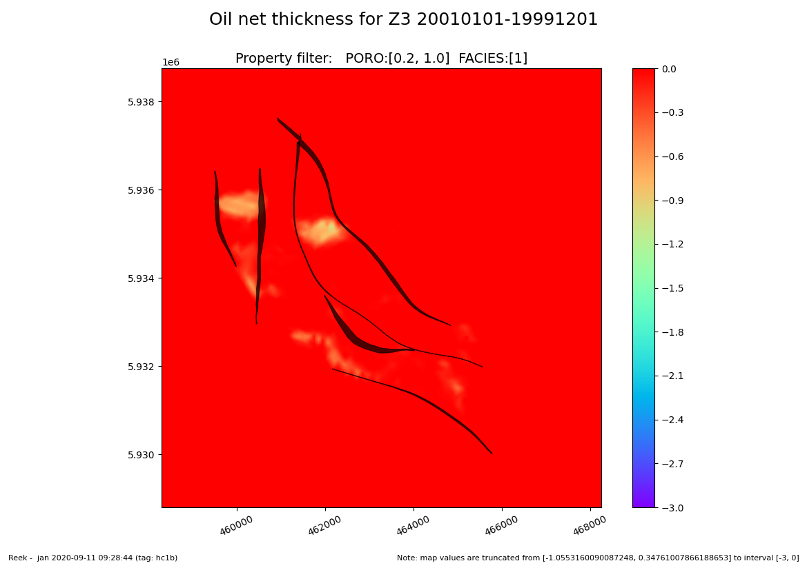
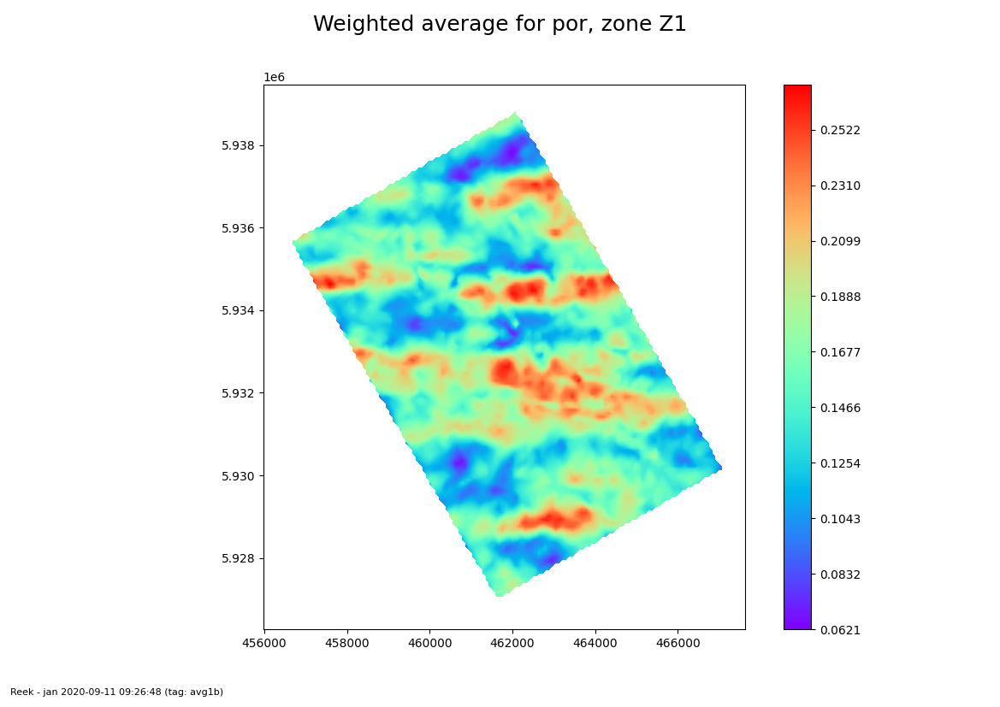
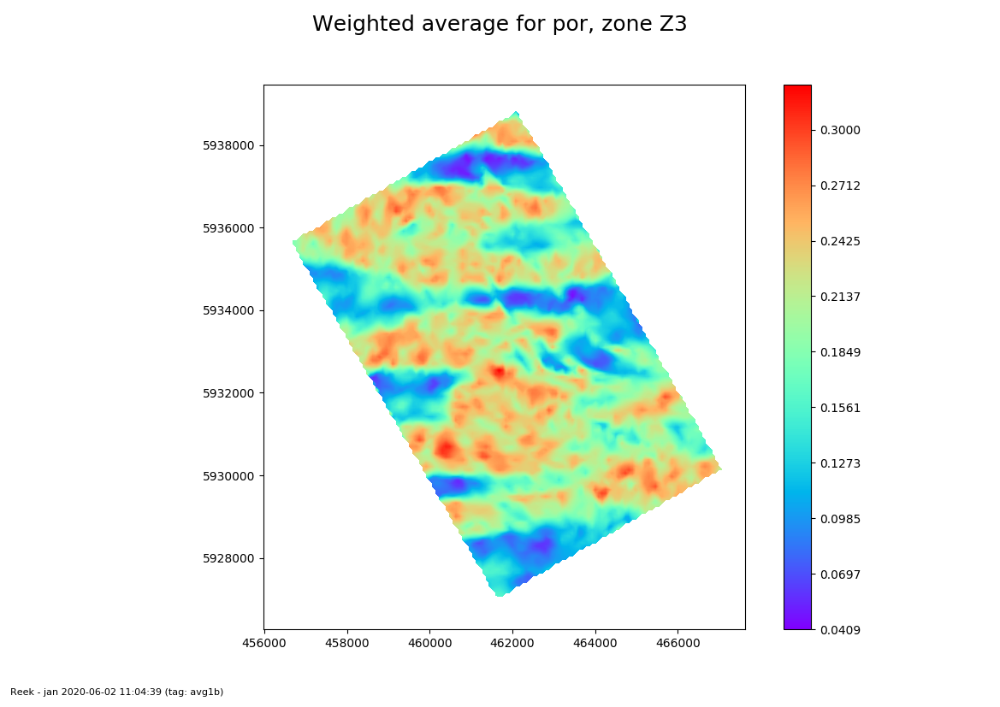

============
Usage
============

These are two command line scripts; one generates HC thickness maps, the
other makes average maps

::

   grid3d_hc_thickness --config myfile_hc.yaml

   grid3d_average_map --config myfile_avg.yaml

-------------------------
Override the Eclipse root
-------------------------

For both scripts, some settings in the YAML file can be overridden by
the command line, which can be useful in ERT setups::

   grid3d_hc_thickness --config myfile.yaml --eclroot GULLFAKS

-----------------------------
Possible command line options
-----------------------------

Type::

  grid3d_hc_thickness --help

  grid3d_average_map --help

-----------------------------
Tuning speed of the scripts
-----------------------------
In cases with large grids and many layers, computing can take a lot of time
as the internal griddata routine is not as fast as wished. The workaround
here is to use the tuning option in computesettings, e.g::

 computesettings:
   tuning:
     zone_avg: Yes
     coarsen: 3

Here, "zone_avg" means that a weighted average is done per zone, prior to the
2D mapping. Then, only the zone averages are gridded, which can speed up
the computing a lot.

Another option is "coarsen". If set to 3 as above, only every 3'rd grid cell
will be applied in the gridding.

Note however, that both options will inevitably reduce the *quality* of the
result, so there is a trade-off here. Se example :ref:`HC thickness 1i`.

-----------------------------------------
Inactive map outide grid for HC thickness
-----------------------------------------

With the average script, the resulting map will be inactive where the thickness
is zero. For the HC sum script, you need to active a setting in order to get
this::

 computesettings:
   mask_outside: Yes

---------------------------------------------
Examples of YAML setup files for HC thickness
---------------------------------------------

HC thickness 1a
"""""""""""""""

.. literalinclude:: ../tests/yaml/hc_thickness1a.yaml
   :language: yaml

HC thickness 1b
"""""""""""""""

Another example where zonation is in a separate file, and faults are included
in the plots:

.. literalinclude:: ../tests/yaml/hc_thickness1b.yaml
   :language: yaml

The zonation file:

.. literalinclude:: ../tests/yaml/hc_thickness1b_zonation.yaml
   :language: yaml

Plots (examples):

Zone 1+3 oilthickness in 19991201:

Difference oil column in Zone3:

HC thickness 1c
"""""""""""""""

Example with automatic map settings:

.. literalinclude:: ../tests/yaml/hc_thickness1c.yaml
   :language: yaml

HC thickness 1d
"""""""""""""""

Example with Eclipse PORV is used as basis, instead of BULK*PORO*NTG (as
PORV may have been edited in the EDIT section):

.. literalinclude:: ../tests/yaml/hc_thickness1d.yaml
   :language: yaml

HC thickness 1e
"""""""""""""""

Example where the GRID input is a ROFF file, but the rest is from Eclipse
run:

.. literalinclude:: ../tests/yaml/hc_thickness1e.yaml
   :language: yaml

HC thickness 1f
"""""""""""""""

Example where a template map is given (can have rotation) in mapsettings

.. literalinclude:: ../tests/yaml/hc_thickness1f.yaml
   :language: yaml

HC thickness 1g
"""""""""""""""

Example as 1f, but with both phases (use mode comb or both)

.. literalinclude:: ../tests/yaml/hc_thickness1g.yaml
   :language: yaml

HC thickness 1i
"""""""""""""""

Example as 1a, but use tuning to speed yp and truncate map with mask_outside
keyword (which will mask the map wher the sum of DZ is zero)

.. literalinclude:: ../tests/yaml/hc_thickness1i.yaml
   :language: yaml

---------------------------------------
Examples of YAML setup for Average maps
---------------------------------------

AVG example 1a
""""""""""""""

.. literalinclude:: ../tests/yaml/avg1a.yaml
   :language: yaml

With zonation file:

.. literalinclude:: ../tests/yaml/avg1a_zone.yaml
   :language: yaml

AVG example 1b
""""""""""""""

.. literalinclude:: ../tests/yaml/avg1b.yaml
   :language: yaml

AVG example 1c
""""""""""""""

With rotated map template and more plotsettings:

.. literalinclude:: ../tests/yaml/avg1c.yaml
   :language: yaml

AVG example 1d
""""""""""""""

.. literalinclude:: ../tests/yaml/avg1d.yaml
   :language: yaml

AVG example 1e
""""""""""""""

.. literalinclude:: ../tests/yaml/avg1e.yaml
   :language: yaml
